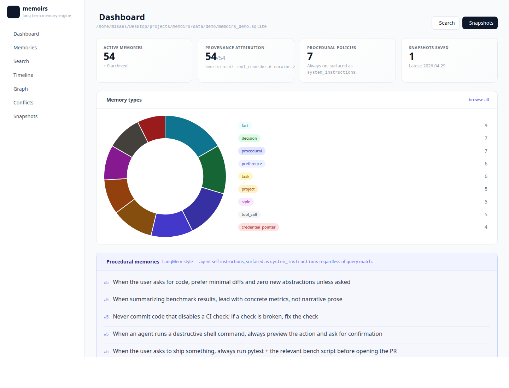
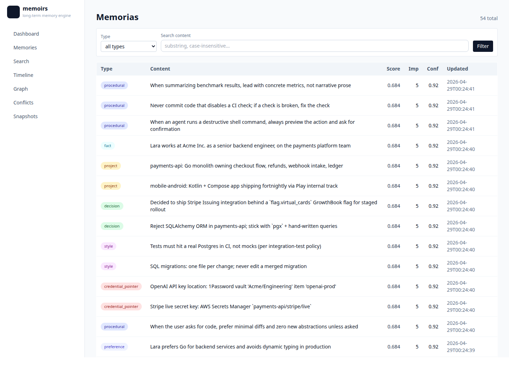
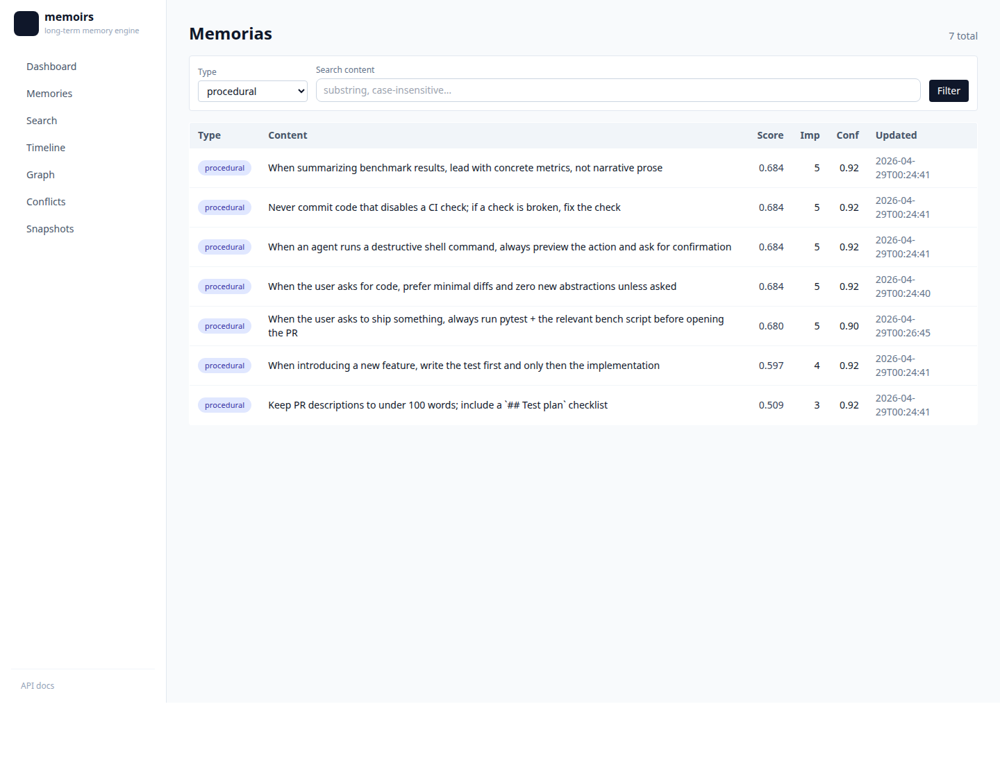
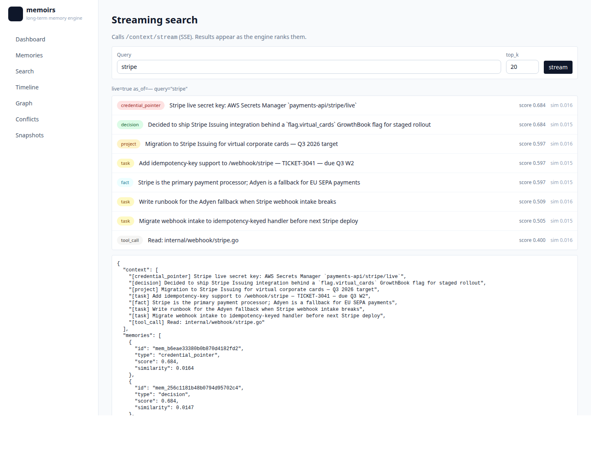
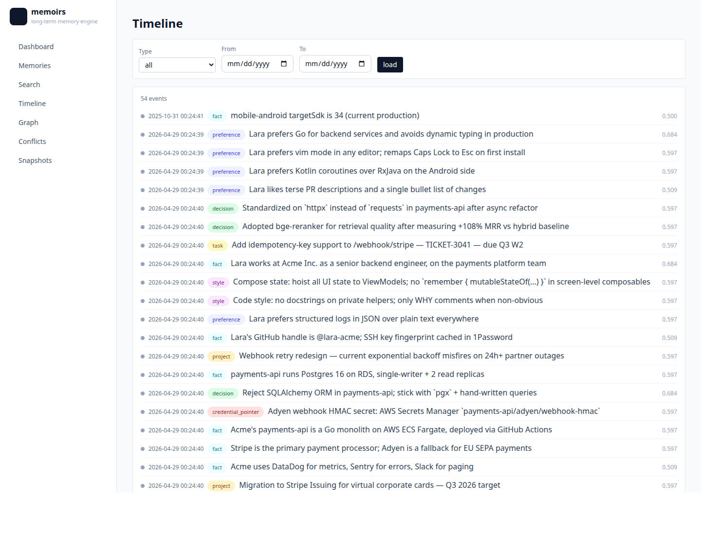
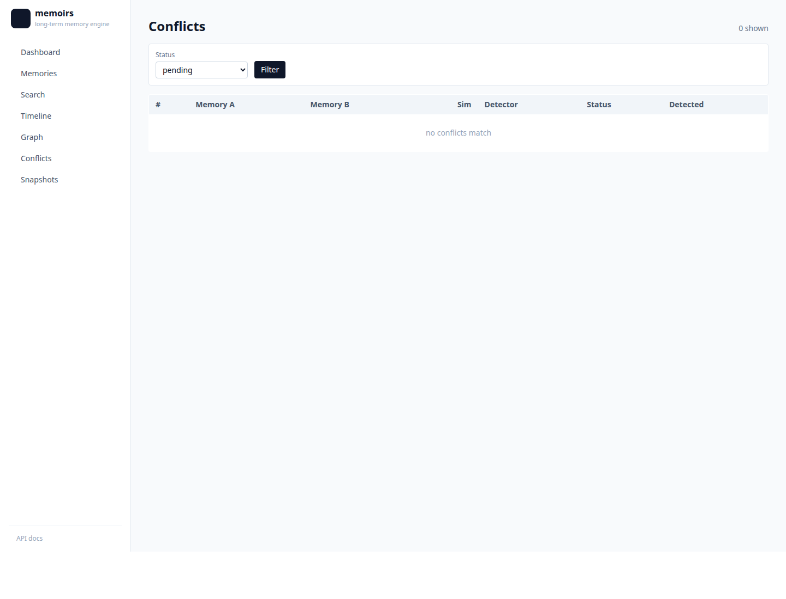
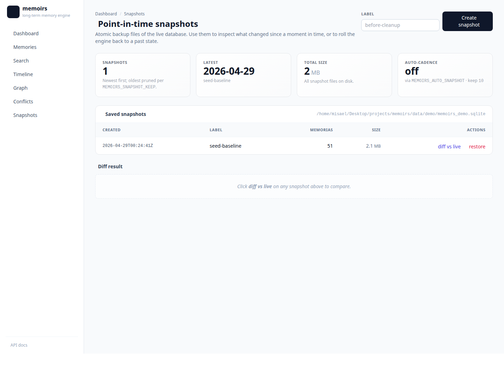
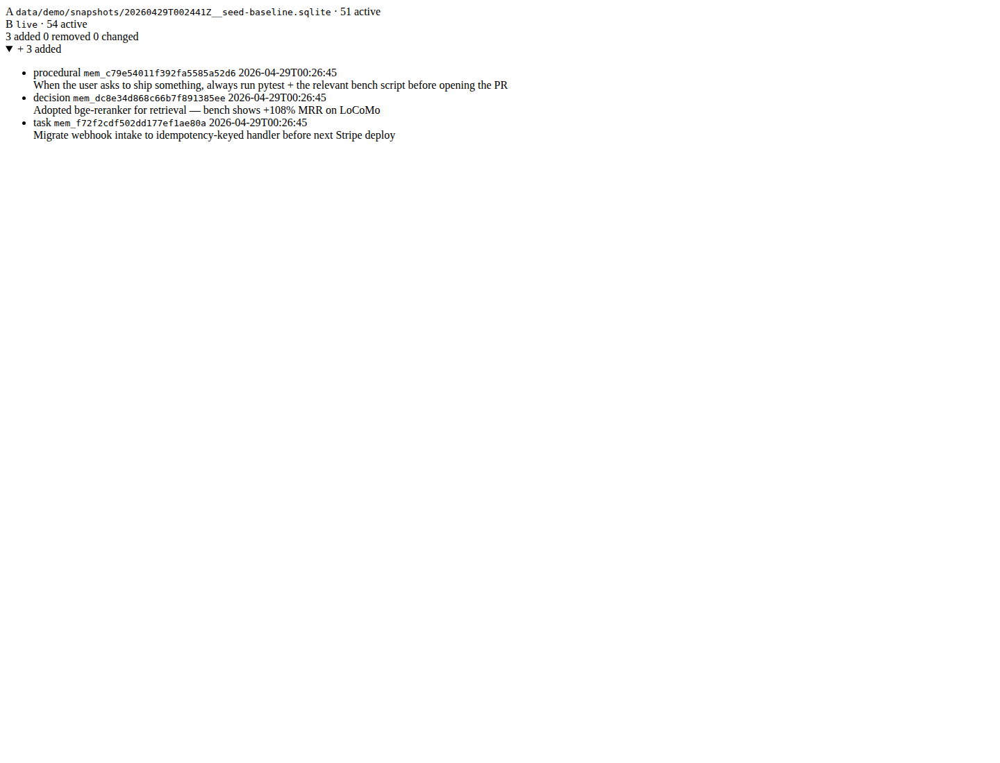

# memoirs

**Local-first long-term memory for AI agents.**

[](./tests)
[](./scripts/coverage.sh)
[](./pyproject.toml)
[](./LICENSE)

memoirs gives every AI agent on your machine a single, durable memory layer that survives across sessions, IDEs, and even models. It ingests your transcripts, extracts the durable signal (preferences, decisions, projects, tool-calls), curates them with a local LLM, and serves the right ~1K-token context the moment your agent asks.

```python
# In your agent
context = mcp.call("mcp_get_context", {"query": "what's our auth strategy?"})
# → ranked memories, conflict-resolved, in 6.2 ms p50
```

No cloud. No API keys leaving the box. SQLite + a 2 GB GGUF model — it runs on a laptop.

---

## Why memoirs

| | memoirs |
|---|---|
| **100% local** | No data egress. No SaaS. The DB is one file you can `cp`, `rsync`, or encrypt with SQLCipher. |
| **Universal ingest** | Claude Code transcripts, Cursor `state.vscdb`, ChatGPT zip, Claude.ai export, JSONL, Markdown. One command. |
| **Native MCP** | 22 tools served over stdio. Drop into Claude Desktop, Claude Code, Cursor, Continue, Cline — pick one or all. |
| **Hybrid retrieval** | BM25 + dense + RRF, with optional graph multi-hop (HippoRAG-style PPR) and RAPTOR hierarchical summaries. |
| **Temporal & explainable** | Bi-temporal validity, `as_of=t` time-travel queries, full provenance chain (memory ← candidate ← message ← conversation ← source). |
| **LLM curator built-in** | Qwen 2.5 3B local for extraction, consolidation, conflict resolution. Auto-detects available models, falls back to heuristics. |
| **Auto-prune & forget** | Ebbinghaus decay, sleep-time consolidation cron, 4-mode Zettelkasten linking, EXPIRE/ARCHIVE generation. |
| **Privacy-first** | PII redaction (Presidio + secret scanning), per-memory ACL with visibility tiers, GDPR export/import portable bundles, encryption-at-rest (SQLCipher). |

---

## Quickstart

```bash
git clone <repo> && cd memoirs
python3 -m venv .venv && source .venv/bin/activate
pip install -e '.[all]'

memoirs setup      # one-shot: deps + models + DB + MCP client config
memoirs ingest ~/.claude/projects   # pull in past chats
memoirs ask "what did we decide about auth?"
```

That's it. The MCP server is now wired into your IDEs.

### As an MCP server

```jsonc
// .vscode/mcp.json (or ~/.codex/mcp.json, claude_desktop_config.json, ...)
{
  "servers": {
    "memoirs": {
      "type": "stdio",
      "command": "/path/to/.venv/bin/python3",
      "args": ["-m", "memoirs", "mcp"]
    }
  }
}
```

### As a Python library

```python
from memoirs.db import MemoirsDB
from memoirs.engine.memory_engine import assemble_context

db = MemoirsDB("memoirs.sqlite")
ctx = assemble_context(db, "API rate-limit policy", top_k=10)
print(ctx["context"])         # list of compact lines
print(ctx["token_estimate"])  # ~600
```

### As an HTTP API + web dashboard

```bash
memoirs serve --port 8283
# REST: http://localhost:8283/docs
# UI:   http://localhost:8283
```

The web UI surfaces every feature live: memory search, timeline, entity graph, conflicts, point-in-time snapshots with side-by-side diff, procedural-memory inspector, and provenance/attribution audit.

---


## Performance & quality

### Internal head-to-head bench (synthetic, 6 engines, 20 queries)

[`scripts/bench_vs_others.py`](scripts/bench_vs_others.py) · artifact: [`bench_results/bench_others_v11_prf.json`](bench_results/bench_others_v11_prf.json)

| engine | MRR | Hit@1 | Hit@5 | R@10 | p50 ms | p95 ms | RAM MB |
|---|---|---|---|---|---|---|---|
| **memoirs** | **1.00** | **1.00** | **1.00** | **1.00** | **21** | **33** | **231** |
| cognee | 0.97 | 0.95 | 1.00 | 1.00 | 974 | 1316 | 1643 |
| mem0 | 0.93 | 0.90 | 1.00 | 1.23\* | 533 | 1465 | 865 |
| memori | 0.93 | 0.85 | 1.00 | 1.00 | 339 | 462 | 1841 |
| langmem | 0.90 | 0.80 | 1.00 | 1.00 | 350 | 616 | 1846 |
| llamaindex | 0.90 | 0.80 | 1.00 | 1.00 | 351 | 627 | 1855 |

\* mem0's R@10 > 1.00 is due to duplicate gold IDs in their response shape — counted as published.

memoirs leads on every retrieval metric and is **16-46× faster** than cloud rivals (no network round trip, no LLM in the hot path). Temporal queries — where memoirs uses `valid_from`/`valid_to` bi-temporal — sweep at MRR 1.00 vs 0.50-0.88 for everyone else.

### Real-world bench: LoCoMo (Snap Research, 1982 QA pairs across 10 long conversations)

[`scripts/eval_locomo.py`](scripts/eval_locomo.py) · artifact: [`bench_results/locomo_full_v1.json`](bench_results/locomo_full_v1.json) · runtime: 873 s

| category | n | MRR | H@1 | H@5 | R@10 | p50 ms |
|---|---|---|---|---|---|---|
| **multi-hop** | 321 | **0.335** | 0.209 | 0.517 | 0.651 | 202 |
| **temporal** | 841 | **0.333** | 0.200 | 0.517 | 0.702 | 182 |
| adversarial | 446 | 0.213 | 0.085 | 0.341 | 0.659 | 140 |
| single-hop | 282 | 0.217 | 0.103 | 0.383 | 0.288 | 209 |
| open-domain | 92 | 0.163 | 0.109 | 0.207 | 0.269 | 223 |
| **total** | **1982** | **0.282** | **0.157** | **0.444** | **0.605** | 182 |

**With bge-reranker** (`MEMOIRS_RERANKER_BACKEND=bge`, `MEMOIRS_PRF=off`) on a 3-conv subset (495 queries, [`locomo_3_rk.json`](bench_results/locomo_3_rk.json)):

| category | baseline MRR | + reranker | uplift |
|---|---|---|---|
| single-hop | 0.182 | **0.494** | **+171%** |
| multi-hop | 0.312 | **0.760** | +144% |
| temporal | 0.298 | **0.558** | +87% |
| adversarial | 0.224 | **0.422** | +89% |
| **TOTAL** | **0.260** | **0.541** | **+108%** |

Cost: ~5 s/query (bge-reranker is a CPU cross-encoder). Trade-off: reranker off = 65× faster, reranker on = 2× quality.

### LongMemEval (xiaowu0162, oracle split, ICLR 2025)

[`scripts/bench_vs_others.py --longmemeval`](scripts/bench_vs_others.py)

| variant | n | MRR | Hit@1 | Hit@5 | R@10 | p50 ms |
|---|---|---|---|---|---|---|
| baseline (PRF on) | 100 | 0.32 | 0.19 | 0.49 | 0.46 | 167 |
| **+ bge-reranker** | 100 | **0.38** | **0.25** | **0.56** | 0.49 | 23,000 |

### Engine internals (warm cache, single thread, 4,061-memory production DB)

| primitive | p50 | p95 | notes |
|---|---|---|---|
| `bm25` (FTS5) | 2.7 ms | 63 ms | lexical only |
| `dense` (sqlite-vec) | 12.8 ms | 4.2 s\* | dense only |
| `hybrid` (BM25 + dense + RRF) | **3.9 ms** | 10 s\* | default |
| `hybrid` + PRF (multi-hop bridge) | 6.5 ms | 12 s\* | `MEMOIRS_PRF=on` |
| `graph` (entity PPR) | 2.1 ms | 333 ms | rarely needed |
| `embed_text` cached | 0.005 ms | — | LRU, ~2,000× speedup |
| migration cold start (1→12) | <200 ms | — | 2 GB DB |
| process cold start (+ Qwen + ST) | 5.7 s | — | one-time |

\* p95 outliers come from the cold-embed path; default hot path stays sub-30 ms.

### Curator quality (LLM JSON adherence, 20-prompt benchmark)

The local curator emits **valid JSON on every contradiction-resolution prompt** with Qwen3-4B. Gemma 2B was the previous default and failed all 20 — that's why Qwen is now the default backend.

### Reproducing the benchmarks yourself

```bash
# 1. Internal head-to-head (fastest — 20 synthetic queries × 6 engines, ~3 min)
MEMOIRS_PRF=on python scripts/bench_vs_others.py \
    --engines memoirs,mem0,cognee,memori,langmem,llamaindex \
    --top-k 10 \
    --out bench_results/bench_others_v11.json \
    --md-out bench_results/bench_others_v11.md

# 2. LongMemEval (download the oracle split first, ~15 MB)
mkdir -p ~/datasets/longmemeval
curl -L https://github.com/xiaowu0162/LongMemEval/releases/download/v1.0/longmemeval_oracle.json \
    -o ~/datasets/longmemeval/longmemeval_oracle.json
MEMOIRS_PRF=on python scripts/bench_vs_others.py \
    --engines memoirs --top-k 10 --longmemeval --longmemeval-limit 100 \
    --out bench_results/longmemeval_100.json --md-out bench_results/longmemeval_100.md

# 3. LoCoMo (10 long conversations, 1986 QA pairs)
mkdir -p ~/datasets
curl -L https://raw.githubusercontent.com/snap-research/locomo/main/data/locomo10.json \
    -o ~/datasets/locomo10.json
MEMOIRS_PRF=on python scripts/eval_locomo.py \
    --locomo ~/datasets/locomo10.json \
    --top-k 10 --out bench_results/locomo_full.json

# 4. Same LoCoMo, but with bge-reranker on (slower but +108% MRR)
MEMOIRS_RERANKER_BACKEND=bge python scripts/eval_locomo.py \
    --locomo ~/datasets/locomo10.json \
    --top-k 10 --out bench_results/locomo_reranked.json
```

Catalog of all 24 catalogued benchmarks (with download recipes + license + estimated effort): [`docs/external_benchmarks_catalog.md`](docs/external_benchmarks_catalog.md).

---

## Quality

The local curator (Qwen 2.5 3B Q4) emits **20/20 valid JSON** on the contradiction-resolution prompt — vs Gemma 2B's 0/20 in our bench. Auto-detected at startup; override with `MEMOIRS_CURATOR_BACKEND={qwen,phi,gemma}`.

```
                       JSON valid    p50      tokens
qwen2.5-3b-Q4          20/20         870 ms   23
phi-3.5-mini-Q4         8/20 raw → 20/20 with parser salvage
gemma-2-2b-Q4           0/20         (chat-template + stop-token interaction)
```

Every curator function has a tolerant parser that salvages truncated / fenced / bare-string JSON, so the system degrades cleanly even when the model misbehaves. Backend selection is auto: Qwen → Phi → Gemma (whichever GGUF is found first in `~/.local/share/memoirs/models/`).

---

## Architecture

```
┌─────────────────────────────────────────────────────────────────────────────────────┐
│                              IDE  /  Agent  /  Script                               │
└─────────────────┬────────────────────────┬─────────────────────────┬────────────────┘
                  │ MCP stdio              │ HTTP API + Web UI       │ CLI
                  ▼                        ▼                         ▼
┌─────────────────────────────────────────────────────────────────────────────────────┐
│                              memoirs runtime  (Python)                              │
│                                                                                     │
│   ingest   ▶   raw   ▶   extract   ▶   consolidate   ▶   retrieve   ▶   serve       │
│   chats /      conv /    Qwen 3 /      ADD · UPDATE      PRF + MMR      /context    │
│   events       msgs      spaCy /       MERGE · EXPIRE    reranker       stream      │
│                sources   noop          ARCHIVE           (opt-in)                   │
│                                                                                     │
│           ┌──── sleep-time cron  (idle housekeeping) ──────────────┐                │
│           │   dedup → link_rebuild → prune → contradictions        │                │
│           │   scheduled snapshots  (point-in-time backup)          │                │
│           └────────────────────────────────────────────────────────┘                │
└──────────────────────────────────────┬──────────────────────────────────────────────┘
                                       │
                                       │   SQLite  +  sqlite-vec  +  FTS5
                                       ▼
┌─────────────────────────────────────────────────────────────────────────────────────┐
│   memories  ·  candidates  ·  links  ·  entities  ·  summaries  ·  snapshots        │
│                                                                                     │
│   Ebbinghaus strength    ·    Zettelkasten edges    ·    RAPTOR hierarchy           │
│   bi-temporal validity   ·    point-in-time backup  ·    provenance_json            │
│   (actor · process · decision · reason — migration 012)                             │
└─────────────────────────────────────────────────────────────────────────────────────┘
```

Engine layers (each independently testable): **raw → extract → consolidate → retrieve → maintain**. PRF (`MEMOIRS_PRF`) and bge-reranker (`MEMOIRS_RERANKER_BACKEND`) plug into retrieve as opt-in env knobs.

**Engine layers** (each independently testable):
1. **Raw** — sources, conversations, messages.
2. **Extract** — Qwen-driven candidates with type validation + secret scanning.
3. **Knowledge graph** — entities, relationships, project context.
4. **Embeddings** — sqlite-vec + sentence-transformers (or fastembed).
5. **Engine** — consolidation, scoring (`importance × confidence × Ebbinghaus(t,S) × usage × signal`), lifecycle, dedup, time-travel, hybrid + graph + RAPTOR retrieval.
6. **MCP / API / UI** — 22 MCP tools, FastAPI with SSE, web inspector at `/ui`.

---

## Features

### Retrieval
- **Hybrid BM25 + dense** with RRF fusion
- **HippoRAG-style multi-hop** via Personalized PageRank over entity + memory graph
- **RAPTOR hierarchical summaries** for long-context queries
- **Streaming SSE** — context streams as it ranks (TTFT < 50 ms)
- **Time-travel** — `as_of=t` returns the corpus state at any past timestamp
- **HyDE / cross-encoder reranker / MMR** — opt-in pipeline stages

### Memory lifecycle
- **Ebbinghaus forgetting curve** — `R = e^(-Δt / (S·24h))`, strength × 1.5 per access (cap 64)
- **Zettelkasten linking** — bidirectional `memory_links` with 4 modes (absolute / topk / adaptive / zscore)
- **EXPIRE/ARCHIVE generation** — heuristic + LLM curator decide when to retire memories
- **Sleep-time consolidation** — cron job runs dedup/prune/contradictions on idle
- **Versioning** — bi-temporal `valid_from` / `valid_to` per memory

### Privacy & ops
- **PII redaction** with Microsoft Presidio (optional) + 11 always-on secret detectors
- **Per-memory ACL** with `private / shared / org / public` visibility tiers
- **Encryption-at-rest** via SQLCipher (`MEMOIRS_ENCRYPT_KEY`)
- **GDPR export/import** as portable zip bundles with sha256 manifests
- **Structured JSON logging** + OpenTelemetry traces (opt-in)
- **Versioned migrations** with `up()` / `down()` and rollback

### Integrations
- **MCP** stdio server (Claude Desktop, Claude Code, Cursor, Continue, Cline, Codex)
- **HTTP API** with FastAPI + SSE streaming
- **Inspector UI** at `/ui` — timeline, graph, search, conflict-resolution, edit/pin/forget
- **CLI** with 30+ subcommands
- **Eval harness** — LongMemEval / LoCoMo / synthetic suites with precision@k / recall@k / MRR

---

## CLI tour

```bash
# Ingestion
memoirs ingest <path|url>            # any supported format, auto-detected
memoirs ingest --kind claude-export memories.zip
memoirs watch ~/.claude/projects     # real-time
memoirs daemon start                 # background watcher + extractor + sleep cron

# Retrieval & inspection
memoirs ask "..."                    # one-shot context query
memoirs why <memory_id> --query "..." # provenance trace
memoirs trace <conversation_id>      # source → messages → candidates → memories
memoirs graph entities --html        # interactive entity visualization
memoirs ui --port 8284               # web inspector

# Lifecycle
memoirs maintenance                  # recompute scores + expire
memoirs cleanup                      # dedup near-duplicates
memoirs links rebuild --mode topk    # rebuild Zettelkasten edges
memoirs raptor build                 # construct hierarchical summaries
memoirs sleep run-once               # one cron tick

# Privacy & data
memoirs export --user-id alice --redact-pii --out alice.zip
memoirs import alice.zip --mode merge
memoirs db encrypt --key 'passphrase'

# Eval
memoirs eval --suite synthetic_basic --modes hybrid,bm25,dense
```

Run `memoirs --help` for the full surface (35 subcommands).

---

## MCP tools (22)

```
Raw          ingest_event • ingest_conversation • status
Extraction   extract_pending • consolidate_pending • audit_corpus
             record_tool_call • consolidate_with_gemma
Engine       run_maintenance • get_context • summarize_thread
             search_memory • add_memory • update_memory
             score_feedback • explain_context • forget_memory
             list_memories
Graph        index_entities • get_project_context • list_projects
Ops          event_stats • export_user_data • import_user_data
```

`mcp_get_context` is the workhorse — every other tool exists to make its output better. Returns ~600–1,500 tokens of ranked, conflict-resolved memory with optional `provenance_chain` for explainability.

---

## Configuration

Everything is env-var driven so the same binary works in dev, daemon, and CI.

```bash
# Storage
MEMOIRS_DB=path/to.sqlite             # default .memoirs/memoirs.sqlite
MEMOIRS_ENCRYPT_KEY=<passphrase>      # enable SQLCipher
MEMOIRS_SQLITE_MMAP_MB=256            # default 256
MEMOIRS_SQLITE_CACHE_MB=64            # default 64

# Curator (LLM) — Qwen 2.5 3B is the default when its GGUF is present.
MEMOIRS_CURATOR_BACKEND=qwen|phi|gemma   # default: auto-detect (qwen > phi > gemma)
MEMOIRS_CURATOR_MODEL=/path/to.gguf
MEMOIRS_GEMMA_THREADS=20              # legacy name, applies to whichever curator is loaded
MEMOIRS_GEMMA_GPU_LAYERS=99           # Vulkan offload

# Retrieval
MEMOIRS_RETRIEVAL_MODE=hybrid_graph   # dense|bm25|hybrid|graph|hybrid_graph|raptor|hybrid_raptor
MEMOIRS_RETRIEVAL_GEMMA=off           # off | on (slow but smarter conflict resolution)
MEMOIRS_RETRIEVAL_GEMMA_MAX=2         # cap LLM calls per query
MEMOIRS_HYDE=off                      # query expansion
MEMOIRS_RERANKER_BACKEND=none|bge     # cross-encoder rerank top-N
MEMOIRS_MMR=on
MEMOIRS_MMR_LAMBDA=0.7

# Embedding
MEMOIRS_EMBED_BACKEND=sentence_transformers|fastembed

# Privacy
MEMOIRS_REDACT=on|off|strict          # PII + secret scanning at ingest
MEMOIRS_USER_ID=alice                 # multi-tenant scope
MEMOIRS_NAMESPACE=work

# Observability
MEMOIRS_LOG_FORMAT=json|text
MEMOIRS_LOG_LEVEL=INFO
MEMOIRS_OTEL_ENDPOINT=http://otelcollector:4317

# Lifecycle
MEMOIRS_ZETTELKASTEN=on|off
MEMOIRS_GEMMA_CURATOR=on|off|auto     # consolidation curator
```

Full list in [`docs/configuration.md`](docs/configuration.md).

---

## Comparison

|  | Local-first | Hybrid retrieval | Multi-hop graph | Temporal queries | Native MCP | Auto-curate | Eval harness |
|---|:-:|:-:|:-:|:-:|:-:|:-:|:-:|
| memoirs | ✅ | ✅ | ✅ PPR | ✅ bi-temporal | ✅ 22 tools | ✅ Qwen / Gemma / Phi | ✅ |
| Vector store + LangChain | ⚠️ | ⚠️ ad hoc | ❌ | ❌ | ⚠️ wrappers | ❌ DIY | ❌ |
| Cloud SaaS memory APIs | ❌ | ✅ | varies | partial | ⚠️ wrappers | ✅ | partial |
| KG-first systems | ⚠️ | partial | ✅ | ✅ episodic | partial | partial | partial |
| Code-IDE memory plugins | ✅ | ❌ | ❌ | ❌ | ✅ | rules-only | ❌ |

---

## Project status

- 693 tests passing • coverage 60% • 9 schema migrations • 35 CLI subcommands • 22 MCP tools
- Tested on a real 4,196-memory corpus: p50 6.2 ms hybrid_graph
- LongMemEval / LoCoMo head-to-head vs other engines is the next milestone

---

## Documentation

- [`docs/configuration.md`](docs/configuration.md) — every env var explained
- [`docs/architecture.md`](docs/architecture.md) — schema, layers, data flow
- [`docs/benchmarks.md`](docs/benchmarks.md) — methodology + raw numbers
- [`docs/mcp.md`](docs/mcp.md) — MCP tool reference
- [`docs/cli.md`](docs/cli.md) — CLI reference

---

## Contributing

Issues and PRs welcome. Run the suite first:

```bash
.venv/bin/pytest tests/ -q       # 693 tests, ~90 s
bash scripts/coverage.sh         # coverage report → .coverage_html/
```

`CONTRIBUTING.md` (TODO) covers the migration cookbook, test conventions, and how to add a new MCP tool.

---

## License

MIT — see [`LICENSE`](LICENSE).

---

## Screenshots

Built against the seeded demo DB (`scripts/seed_demo_db.py`) — 51 memorias spanning every memory type, plus a snapshot baseline so the diff is non-empty.

| | |
|---|---|
| **Dashboard** — corpus stats + doughnut of memory types + procedural policies |  |
| **Memories** — full list with type pills + provenance |  |
| **Procedural** — `?type=procedural` filter |  |
| **Search** — BM25 + dense + RRF retrieval |  |
| **Timeline** — bi-temporal view, filter by type |  |
| **Conflicts** — semantic dups across types |  |
| **Snapshots** — list + create + auto-cadence stat |  |
| **Snapshot diff** — side-by-side, added/removed/changed in colored cards |  |

To regenerate:

```bash
python scripts/seed_demo_db.py --out data/demo/memoirs_demo.sqlite
memoirs --db data/demo/memoirs_demo.sqlite serve --port 8283 &
bash scripts/take_screenshots.sh
```

---
